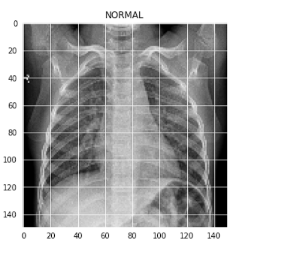
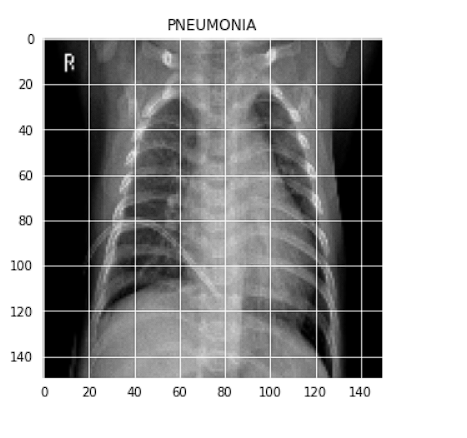
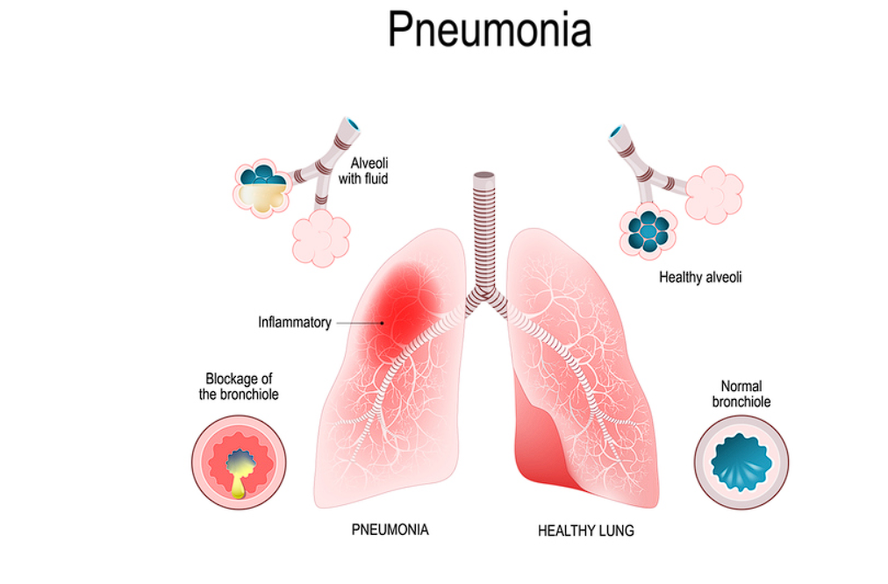
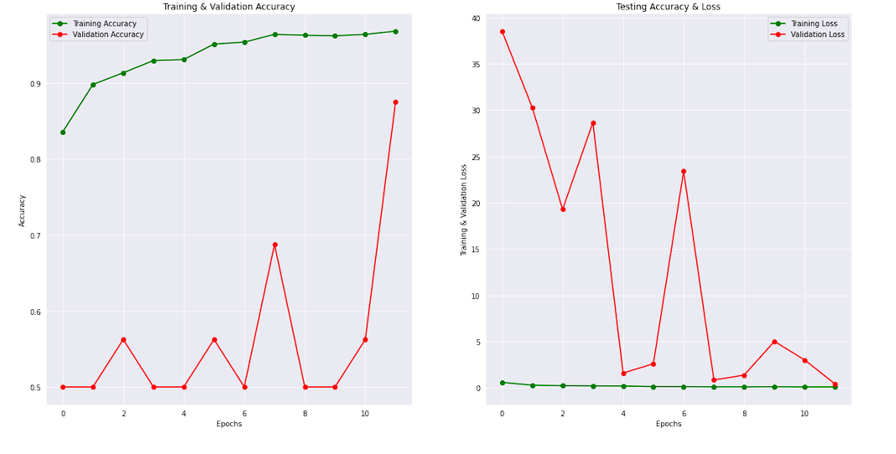
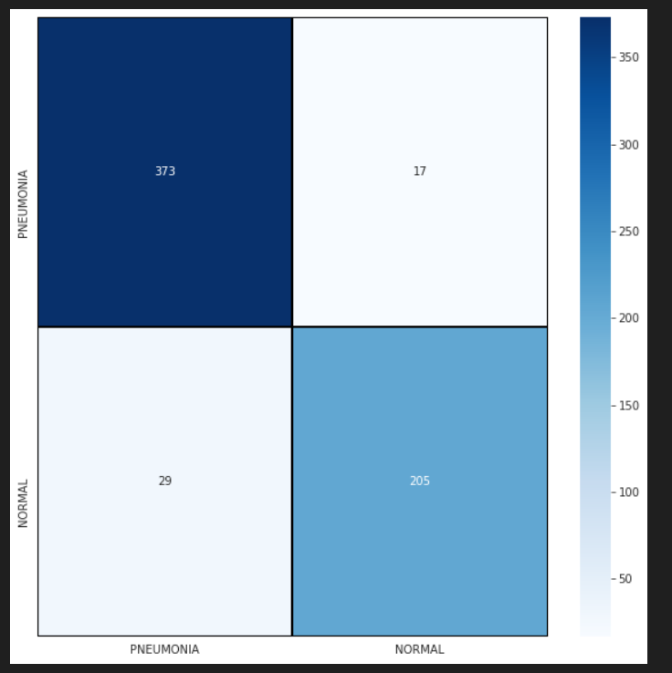

# 🩺 Pneumonia Detection using Convolutional Neural Networks (CNN)

**Automated classification of Chest X-Ray images into Pneumonia / Normal using Deep Learning — 92.6% test accuracy**


---

## 📌 Overview

Pneumonia is an inflammatory lung condition that is traditionally diagnosed by radiologists through manual review of chest X-rays — a process that is time-consuming, dependent on expert availability, and subject to inter-observer variability. This project builds a **Convolutional Neural Network (CNN)** that automatically classifies chest X-ray images as **Pneumonia** or **Normal**, demonstrating how deep learning and computer vision can be applied to real-world **medical image analysis and diagnostic support**.

The model is trained end-to-end on grayscale chest radiographs and achieves **92.6% accuracy** on the held-out test set, with a full pipeline covering data preprocessing, class-imbalance handling, augmentation, training, and quantitative evaluation.

---

## 🏥 Relevance to the Medical & Healthcare Industry

This project is a small-scale demonstration of the kind of AI-driven medical image analysis used in modern **digital pathology, radiology, and diagnostic workflows**:

- **Faster triage** — flags likely-pneumonia cases for priority review, reducing turnaround time in high-volume clinical settings.
- **Diagnostic support, not replacement** — acts as a "second opinion" system that assists radiologists/pathologists rather than replacing clinical judgment.
- **Scalability** — once trained, a CNN can screen thousands of images consistently, which is critical in resource-constrained hospitals and labs with limited specialist availability.
- **Consistency** — reduces inter-observer variability that naturally occurs between different human readers.
- **Foundation for larger systems** — the same principles (preprocessing → CNN feature extraction → classification) extend to segmentation, detection, and quantification tasks used in **digital pathology** for analyzing high-resolution whole-slide images (WSIs), microbiology imaging, and ophthalmology scans.
- **Research & publication pipeline** — the structured experimentation (metrics, confusion matrix, error analysis) mirrors the workflow used to validate models before clinical deployment or publication.

In short, this project reflects the core skill set needed for AI/ML roles in **life-sciences and healthtech companies** building diagnostic, prognostic, and predictive imaging solutions — analyzing medical images with computer vision and deep learning to improve diagnostic accuracy and efficiency.

---

## 🖼️ Dataset

- **Source:** [Chest X-Ray Images (Pneumonia)](https://www.kaggle.com/datasets/paultimothymooney/chest-xray-pneumonia) — Guangzhou Women and Children's Medical Center.
- **Size:** 5,863 chest X-ray images (JPEG), organized into `train`, `test`, and `val` folders.
- **Classes:** `PNEUMONIA`, `NORMAL`
- **Type:** Anterior–posterior chest radiographs of pediatric patients (1–5 years old), screened for quality and graded by two expert physicians before being used for training.

*(See the [Project Structure](#-project-structure) section below for how this folder fits alongside the notebook and images.)*

| Normal | Pneumonia |
|--------|-----------|
|  |  |

*(These are the actual notebook outputs, saved to the `images/` folder — see below for all of them in one place.)*

---

## 🖼️ All Results at a Glance



*A single combined image with the class distribution, sample X-rays, training/validation curves, confusion matrix, and correct/incorrect prediction examples — extracted directly from the notebook's run outputs.*

---

## 🛠️ Tech Stack

| Category | Tools / Libraries |
|---|---|
| Language | Python 3 |
| Deep Learning | Keras, TensorFlow (backend) |
| Image Processing | OpenCV (`cv2`) |
| Data Handling | NumPy, Pandas |
| Visualization | Matplotlib, Seaborn |
| Evaluation | scikit-learn (`classification_report`, `confusion_matrix`) |
| Environment | Jupyter Notebook (Kaggle kernel) |

---

## 🧠 Model Architecture

A custom sequential CNN built with `keras.models.Sequential`:

- Multiple **Conv2D** blocks (32 → 64 → 64 → 128 filters), each with:
  - `ReLU` activation
  - `BatchNormalization`
  - `MaxPooling2D` for spatial downsampling
  - `Dropout` layers to reduce overfitting
- **Dense (fully connected)** layers leading to a final classification output
- Input: grayscale images resized to **150 × 150 × 1**
- Optimizer callback: `ReduceLROnPlateau` (monitors validation accuracy, reduces learning rate on plateau)

### Data Preprocessing & Augmentation
- Grayscale conversion and resizing to 150×150
- Pixel normalization to the `[0, 1]` range for faster convergence
- **Data augmentation** (via `ImageDataGenerator`) to counter class imbalance and overfitting:
  - Rotation (±30°)
  - Zoom (20%)
  - Width/height shift (10%)
  - Horizontal flip

---

## 📊 Results

| Metric | Value |
|---|---|
| **Test Accuracy** | **92.6%** |
| Loss | Reported via `model.evaluate()` |
| Evaluation | Classification report (precision/recall/F1) + Confusion matrix heatmap |

The notebook includes:
- Training vs. validation accuracy/loss curves across epochs
- A confusion matrix visualized as a heatmap
- Side-by-side examples of **correctly** and **incorrectly** classified X-rays for qualitative error analysis

**Training curves:**



**Confusion matrix:**



---

## 🚀 Getting Started

### Prerequisites
```bash
pip install numpy pandas matplotlib seaborn opencv-python scikit-learn keras tensorflow
```

### Run the notebook
1. Download the dataset from Kaggle: [Chest X-Ray Images (Pneumonia)](https://www.kaggle.com/datasets/paultimothymooney/chest-xray-pneumonia)
2. Update the dataset path in the notebook (`get_training_data(...)` calls) to point to your local `chest_xray/train`, `test`, and `val` folders.
3. Open and run `pneumonia-detection-using-cnn-92-6-accuracy.ipynb` cell by cell in Jupyter or Kaggle.

---

## 📁 Project Structure

```
.
├── pneumonia-detection-using-cnn-92-6-accuracy.ipynb   # Main notebook: data loading → training → evaluation
├── README.md
├── images/                                             # All result images used in this README
│   ├── all_images_overview.png
│   ├── class_distribution.png
│   ├── sample_pneumonia.png
│   ├── sample_normal.png
│   ├── training_validation_curves.png
│   ├── confusion_matrix.png
│   ├── correct_predictions.png
│   └── incorrect_predictions.png
└── chest_xray/                                         # Dataset (download separately, see below)
    ├── train/
    │   ├── PNEUMONIA/
    │   └── NORMAL/
    ├── test/
    │   ├── PNEUMONIA/
    │   └── NORMAL/
    └── val/
        ├── PNEUMONIA/
        └── NORMAL/
```

---

## 🔭 Future Scope

- Extend from binary classification to **multi-class** classification (e.g. bacterial vs. viral pneumonia vs. normal).
- Apply **transfer learning** (e.g. ResNet, DenseNet, EfficientNet) for improved accuracy and generalization.
- Add **Grad-CAM / saliency visualization** to highlight the lung regions driving each prediction, improving clinical interpretability and trust.
- Extend the pipeline toward **high-resolution digital pathology images** (segmentation, detection, and quantification tasks), moving from single-image classification toward whole-slide image analysis.
- Package the model behind a simple inference API for integration into a clinical decision-support demo.

---

## ⚠️ Disclaimer

This project is for **educational and research purposes only**. It is **not a certified medical device** and must not be used for actual clinical diagnosis without proper validation, regulatory clearance, and supervision by qualified medical professionals.

---

## 📄 License

This project is released under the [MIT License](LICENSE).
